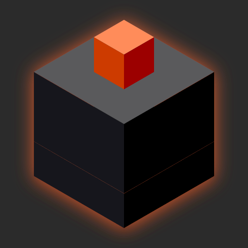
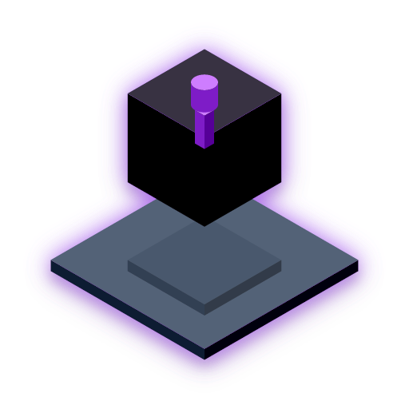
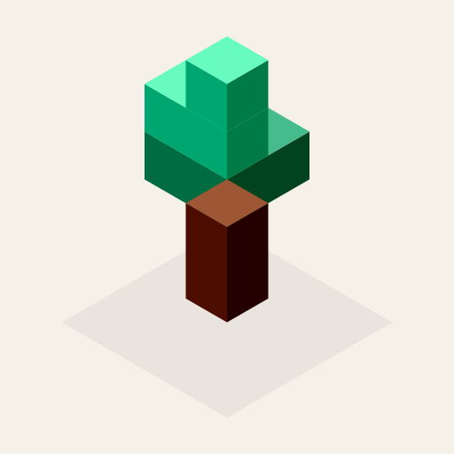
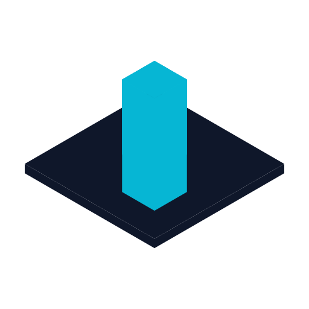
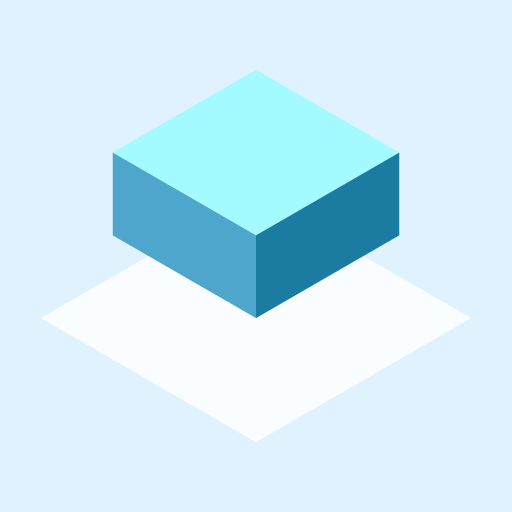
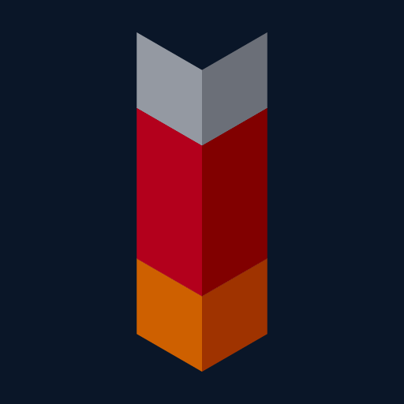

# IsoForge

**Describe it. Watch it build. Ship the cube.**

A CLI that generates isometric cube-art logos through conversation. Instead of
producing unpredictable pixels, an LLM edits a strict typed JSON scene graph — the
**IsoDSL** — which a deterministic engine renders to SVG, PNG and app-icon bundles.

The result is a logo you can diff, version, revert and re-theme like source code.

```console
$ isoforge chat
› a logo for a static site generator: three flat slabs offset like shifted
  paper, warm orange on charcoal

  Create Slab logo: three stacked orange slabs offset diagonally
  v1 · rewrote
  [isometric preview renders in your terminal]

› add a small glowing cube floating above the top slab

  v2 · patched
› /diff
  v1 → v2  +1 -0 ~0
    add      /effects
```

That second turn is the point: the change became a **one-operation patch**, not a
regenerated image. Nothing else about the design moved.

## Showcase

Each of these was a single opening prompt to `isoforge chat`, no follow-up edits.

<table>
<tr>
<td></td>
<td>

> a blacksmith startup logo: a dark anvil block with a glowing orange ember
> cube on top, on charcoal background

</td>
</tr>
<tr>
<td></td>
<td>

> a security company logo: a solid dark cube with a glowing purple keyhole
> cutout, floating above a reflective platform

</td>
</tr>
<tr>
<td></td>
<td>

> an eco startup logo: a small green tree made of stacked cube foliage on a
> brown trunk cube, warm cream background

</td>
</tr>
<tr>
<td></td>
<td>

> a fintech logo: a stack of three thin cyan slabs rising like a bar chart,
> each one taller than the last, on deep navy

</td>
</tr>
<tr>
<td></td>
<td>

> a minimalist cloud logo: one large single rounded cube cloud shape in sky
> blue sitting on a thin white ground plane, simple and clean, pale blue
> background

</td>
</tr>
<tr>
<td></td>
<td>

> a clean isometric rocket ship logo made of stacked cubes: a tall silver
> nose cone cube, a red body cube below it, and an orange flame cube at the
> base, on deep navy background, no floating detached parts

</td>
</tr>
</table>

## Install

```bash
pipx install isoforge
export OPENROUTER_API_KEY=sk-or-...   # or ANTHROPIC_API_KEY, or run Ollama
isoforge doctor
```

Pure Python, one process, no system dependencies.

## Usage

**Designing**

```bash
isoforge chat                          # start a NEW design
isoforge chat --name nimbus            # ...and name it
isoforge chat "a cloud logo, sky blue" # ...with an opening prompt
isoforge chat --resume                 # continue your most recent design
isoforge chat -P nimbus                # continue a specific design
isoforge chat -c logo.isoforge.json    # resume from an exported file
isoforge chat -p ollama -m qwen3:8b    # local, offline
```

Every `isoforge chat` starts its own design; unnamed ones get a timestamped handle.
Use `--resume` or `-P` when you mean to continue an existing one.

**Managing designs**

```bash
isoforge list                          # all designs, with palettes and tags
isoforge list --tag work               # filter by tag
isoforge info -P nimbus                # details for one design
isoforge edit -P nimbus --name "Nimbus Cloud" --tags work,client
isoforge edit -P nimbus --rename nimbus-v2     # change its handle
isoforge delete -P old-draft
```

**Versions and export**

```bash
isoforge show                          # render in the terminal
isoforge history                       # list versions
isoforge diff v2 v3                    # see exactly what changed
isoforge revert 2                      # restore v2 (appends a new version)
isoforge export png --size 512
isoforge export svg|json|icons         # icons = favicon.ico + .icns-ready bundle
isoforge theme save my-brand
```

All version commands accept `-P <design>` to target a specific design; without it they
use your most recent.

In-chat: `/preview` `/history` `/diff` `/revert n` `/export png` `/json` `/themes` `/help`

## How it works

```
isoforge chat
   ├─ agent/     LLM tool-calling, validation, repair loop
   ├─ isodsl/    schema, geometry, color
   ├─ render/    SVG → PNG → icon bundles
   └─ store.py   versions as JSON files on disk
```

One process, one language. Each design lives in its own directory:

```
~/.local/share/isoforge/
├── nimbus/
│   ├── project.json          name, description, tags
│   ├── v1.isoforge.json      every turn is a version
│   ├── v2.isoforge.json
│   └── latest.isoforge.json  → always the newest
└── vault/
    └── ...
```

Readable, diffable, and easy to commit alongside your code.

### The guarantee

Raw LLM text is **never** parsed as design data. The model's only channel is two tool
calls — `set_scene` and `patch_scene` — and every payload must pass JSON Schema
validation plus semantic rules before it is stored or rendered. Invalid output is fed
back with precise error codes for up to two repair attempts; if it still fails, your
existing design is untouched.

Rendering is deterministic by construction: the same scene always produces
byte-identical SVG. Paint order comes from geometry (`x+y+z`, ties broken by `id`),
never array order, so adding a shape can't silently restack the others. Golden tests
pin exact output bytes.

## The IsoDSL

```jsonc
{
  "isodsl_version": "1.0.0",
  "canvas": { "width": 512, "height": 512, "background": null },
  "grid":   { "w": 8, "d": 8, "h": 8, "cell": 32 },
  "palette": { "colors": { "base": "#7C5CFF", "accent": "#22D3EE" } },
  "shapes": [
    { "id": "core", "type": "cube", "at": {"x":0,"y":0,"z":0}, "fill": "@palette.base" }
  ]
}
```

Primitives: `cube`, `ramp`, `cylinder`, `plane`, `group`. Give a shape one `fill` and
the renderer derives its three faces by shifting lightness in **OKLab**, which keeps
saturated brand colors on-hue instead of turning them grey.

Full schema: [`schemas/isodsl/v1/isodsl.schema.json`](schemas/isodsl/v1/isodsl.schema.json)
· semantic rules: [`RULES.md`](schemas/isodsl/v1/RULES.md)

## Development

```bash
make install   # editable install
make test      # 202 tests
make lint
make golden    # regenerate render goldens (review the diff!)
```

## License

MIT
